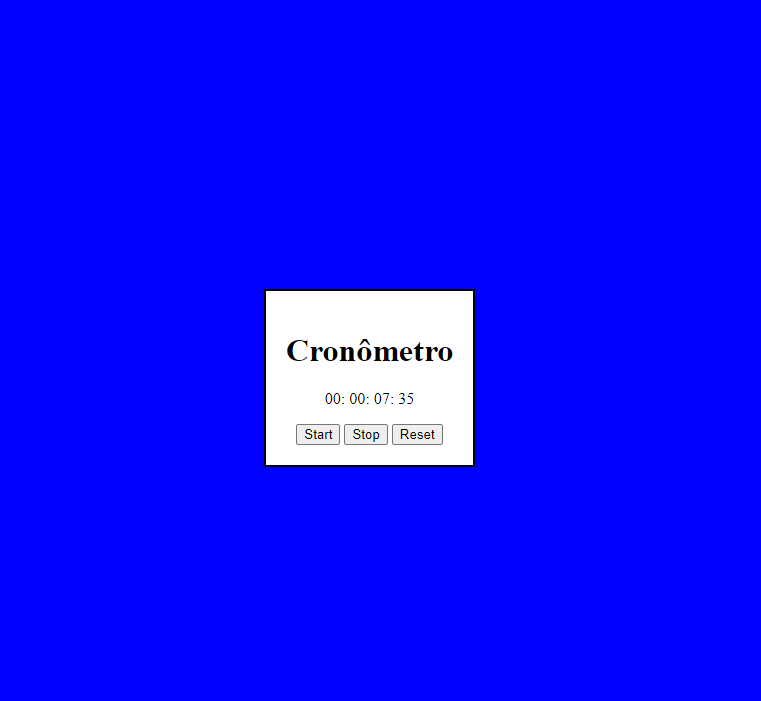

# Cronômetro

  

## Sobre o projeto

Projeto criado para praticar conhecimentos e conceitos de HTML, CSS e JavaScript com um cronômetro

- Consiste em iniciar, parar e zerar o tempo.

## 🚀 Tecnologias

Esse projeto foi desenvolvido com as seguintes tecnologias:

- ✔️ HTML

- ✔️ CSS

- ✔️ JavaScript

Made with 💜 by David Bento 👋 [See my linkedin](https://www.linkedin.com/in/david-bento)
